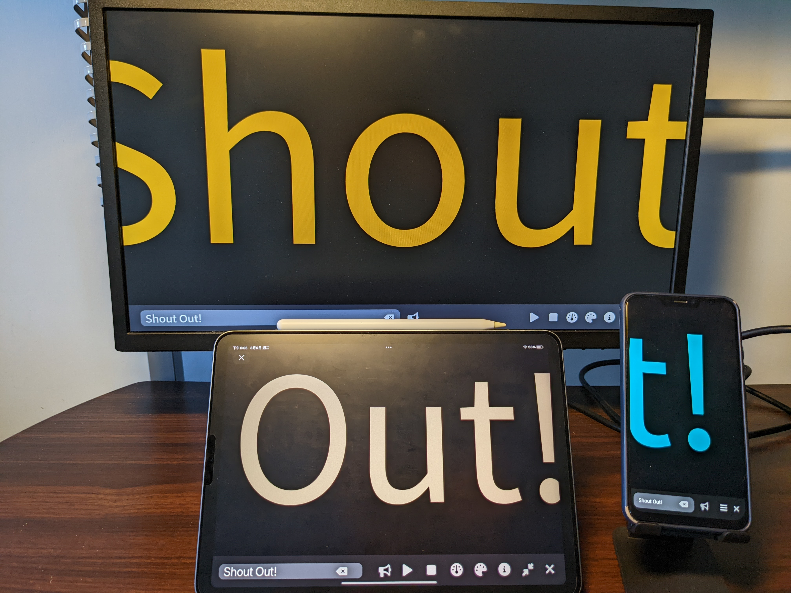

# ShoutOut

## About
This is yet another hobby project.
I was inspired by my friend who wanted to use his smartphone to display a message in a news-ticker-like way.

You can use the app on any device you like, e.g, desktop, laptop, tablet, or smartphone.
Just go [here](https://alan-kuan.github.io/ShoutOut) with a browser and type in your words.

By the way, this was done without any framework or external library just because I felt like going back to the origin and finishing the task in a "vanilla" way.

## License
Copyright (c) 2022 Alan Kuan. See [LICENSE](LICENSE) for details.
